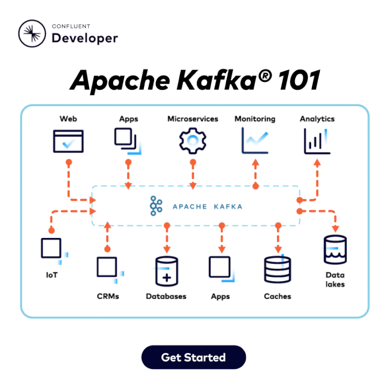

# Desarrollo de arquitectura Orioentada a Eventos
## SpringBoot 3 y Kafka

## Crear imagenes
1. Posicionarse en la carpeta desde la terminal
2. Ejecutar el comando `docker build -t marlon1993fig/str-producer:1.0.1 .`
3. Ejecutar el comando `docker build -t marlon1993fig/str-consumer:1.0.1 .`
4. Posicionarse en carpeta raiz .
5. Ejercutar para probar cambios docker-compose up -d
6. Publicar en Docker Hub
  6.1. `docker push marlon1993fig/str-producer:1.0.1`
  6.2. `docker push marlon1993fig/str-producer:1.0.1`

***Nota:*** Para cada ajuste en los proyectos java se debe recrear la imagen del contenedor
